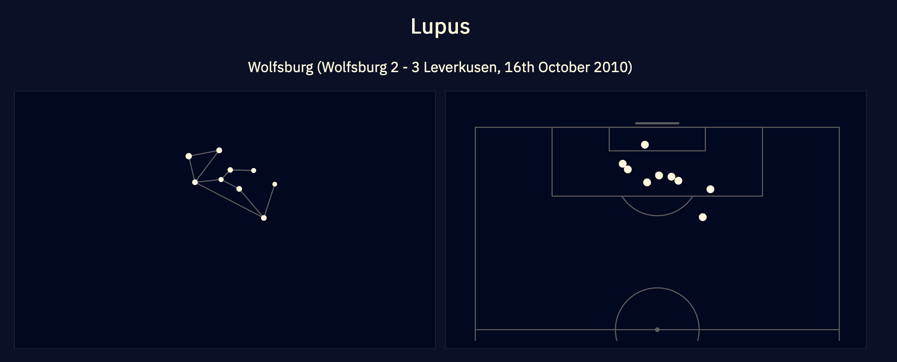

# Nebra Shot Maps

Matching constellations to shot maps.

Run `make all` to run the matching algorithm for all constellations and view the results at `data/constellations/{constellation}/...`. Make sure you've checked the **Requirements** below and be warned, running the matching algorithm for every constellation can be pretty slow and I have made ~no effort to optimise it!

## Results

And I posted a few more examples [on Twitter](https://twitter.com/Torvaney/status/1518993765830176770).

## Requirements

* A Python environment (assumed to be at `venv`, unless otherwise set with the `PYTHON_VENV` environment variable). Anything version 3.6+ should be fine.
* An R installation, with the [tidyverse](https://github.com/tidyverse/tidyverse) and [ggsoccer](https://github.com/Torvaney/ggsoccer) installed. I used v3.6.3 (I haven't tested v4, but I assume that's fine, too)
* `data/shots.csv`. I used a csv with the following columns, one row per shot. Fields that aren't used by the main algorithm are shown in square brackets. Skipping these columns won't matter, but will result in a warning message.
  - [`id`]
  - `game_id`
  - `team_id`
  - [`team`]
  - [`game_label`]
  - [`kickoff`]
  - `x`
  - `y`
  - [`event_type`]

## Nebra?

The name for this project is a play on the [Nebra sky disc](https://en.wikipedia.org/wiki/Nebra_sky_disc).
